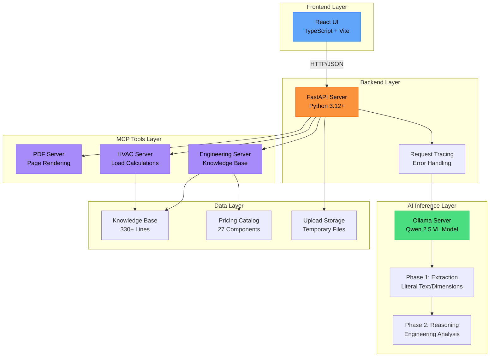
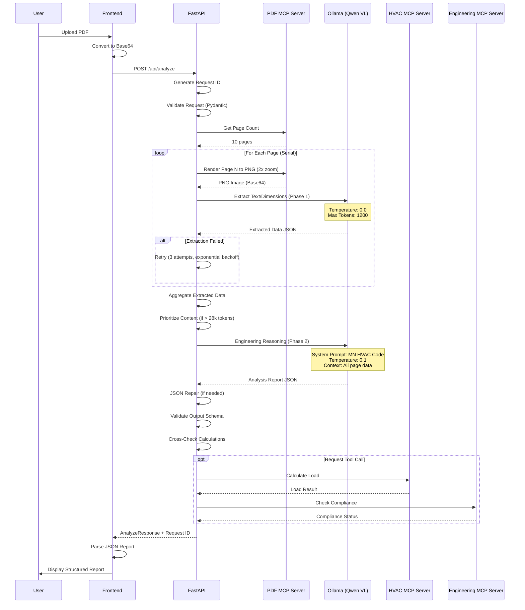
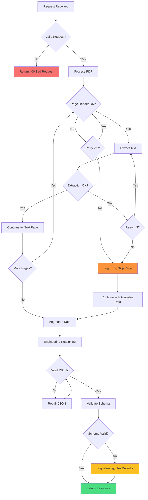

<div align="center">


# HVAC Analysis AI

### Local-First AI-Powered HVAC Engineering Analysis

[](https://opensource.org/licenses/MIT)
[](https://www.python.org/downloads/)
[](https://nodejs.org/)
[](https://www.typescriptlang.org/)

**Analyze HVAC blueprints and generate code compliance reports using local AI inference**

[Getting Started](#-quick-start) • [Documentation](#-documentation) • [Architecture](#-architecture-overview) • [API Reference](#-api-reference) • [Contributing](#-contributing)

</div>

---

## 📑 Table of Contents

- [Overview](#-overview)
- [Key Features](#-key-features)
- [Architecture Overview](#-architecture-overview)
- [Quick Start](#-quick-start)
- [Installation](#-installation)
- [Configuration](#-configuration)
- [Usage Guide](#-usage-guide)
- [API Reference](#-api-reference)
- [Data Flow](#-data-flow)
- [MCP Servers](#-mcp-servers)
- [Performance](#-performance)
- [Security](#-security)
- [Troubleshooting](#-troubleshooting)
- [Development](#-development)
- [Deployment](#-deployment)
- [Documentation](#-documentation)
- [Contributing](#-contributing)
- [License](#-license)

---

## 🎯 Overview

HVAC Analysis AI is a **flexible AI-powered** application that provides HVAC engineering analysis using your choice of AI providers. It supports both **local inference via Ollama** (privacy-focused) and **cloud inference via Google Gemini** (fast and scalable) to analyze blueprints, calculate heating/cooling loads, verify equipment sizing, and ensure Minnesota HVAC code compliance.

### AI Provider Options

**Ollama (Local-First)**
- **🔒 Privacy**: Your blueprints never leave your machine
- **⚡ No API Costs**: Run unlimited analyses without per-request charges
- **🔌 Offline Capable**: Works without internet after initial setup
- **Model**: Qwen 2.5 VL vision-language model

**Google Gemini (Cloud)**
- **⚡ Fast Inference**: Quick processing without local GPU requirements
- **🌐 Always Available**: No local setup or maintenance needed
- **🎯 Latest Models**: Gemini 2.5 Flash and Gemini 3 Flash Preview
- **💰 Pay-as-you-go**: Cost-effective for occasional use

See [GEMINI_INTEGRATION.md](docs/GEMINI_INTEGRATION.md) for setup instructions.

## ✨ Key Features

### 🔍 Intelligent Analysis
- **Flexible AI Providers**: Choose between Ollama (local) or Google Gemini (cloud)
- **Vision-Language Models**: Qwen 2.5 VL (Ollama) or Gemini 2.5/3 Flash (cloud)
- **Multi-Page Support**: Process PDFs up to 50 pages with intelligent prioritization
- **Extract-Then-Reason Pipeline**: Two-phase analysis for accuracy
- **Component-Level Breakdown**: Detailed heating/cooling load calculations

### 📋 Code Compliance
- **Minnesota HVAC Code**: Automated compliance checking (Rules 1322.0403, 1322.0404)
- **Equipment Sizing Validation**: Prevents oversizing (40% heating, 15% cooling limits)
- **ASHRAE Standards**: Ventilation, economizer, and efficiency requirements
- **Manual J Calculations**: Climate Zone 7 load calculations

### 🛠️ Engineering Tools
- **MCP Tool Suite**: Deterministic calculations via Model Context Protocol
- **Pricing Catalog**: Equipment cost estimation with 27+ components
- **Knowledge Base**: 330+ lines of HVAC engineering reference
- **Insulation Validation**: R-value compliance checking

### 💪 Robust & Reliable
- **Type Safety**: Full Pydantic (Python) + TypeScript coverage
- **Error Handling**: Retry logic with exponential backoff
- **Graceful Degradation**: Continue processing if individual pages fail
- **Request Tracing**: End-to-end observability with unique request IDs
- **JSON Repair**: Auto-correction of malformed LLM outputs

### ⚡ Performance Optimized
- **8GB VRAM Target**: Optimized for consumer-grade GPUs
- **Configurable Quality**: Fast (1.5x) to Ultra (4.0x) PDF rendering
- **Context Management**: Smart truncation and prioritization
- **Resource Monitoring**: VRAM and token usage tracking

---

## 🏗️ Architecture Overview

### System Architecture



### Technology Stack

| Layer | Technology | Purpose |
|-------|-----------|---------|
| **Frontend** | React 19 + TypeScript 5.8 | User interface and interaction |
| **Build Tool** | Vite | Fast development and optimized production builds |
| **Styling** | Tailwind CSS | Modern, responsive design |
| **Backend** | FastAPI + Python 3.12+ | REST API and orchestration |
| **Data Validation** | Pydantic | Type-safe request/response models |
| **AI Engine** | Ollama (Qwen 2.5 VL) | Local vision-language model inference |
| **Document Processing** | PyMuPDF (fitz) | PDF rendering and manipulation |
| **MCP Protocol** | Custom Implementation | Tool-calling for deterministic operations |

### Project Structure

```
hvac/
├── frontend/                    # React + TypeScript frontend
│   ├── src/
│   │   ├── components/         # Reusable UI components
│   │   │   ├── Icons.tsx       # SVG icon components
│   │   │   ├── HVACReportViewer.tsx  # Structured report display
│   │   │   └── MarkdownRenderer.tsx  # Fallback markdown viewer
│   │   ├── views/              # Main application views
│   │   │   └── MainLayout.tsx  # Primary app layout
│   │   ├── features/           # Feature-specific components
│   │   │   ├── LeftPanel.tsx   # File upload and preview
│   │   │   ├── RightPanel.tsx  # Analysis results display
│   │   │   └── TopBar.tsx      # Application header
│   │   ├── services/           # API services and utilities
│   │   │   ├── aiService.ts    # Backend API client
│   │   │   └── apiTypes.ts     # TypeScript type definitions
│   │   ├── App.tsx             # Root application component
│   │   ├── index.tsx           # Application entry point
│   │   └── types.ts            # Shared type definitions
│   ├── index.html              # HTML template
│   ├── package.json            # Frontend dependencies
│   ├── vite.config.ts          # Vite configuration
│   └── tsconfig.json           # TypeScript configuration
│
├── backend/                     # FastAPI Python backend
│   ├── mcp_servers/            # Model Context Protocol servers
│   │   ├── pdf_server.py       # PDF processing and rendering
│   │   ├── hvac_server.py      # HVAC calculation engine
│   │   └── engineering_server.py  # Knowledge base and tools
│   ├── data/                   # Static data files
│   │   ├── knowledge_base.txt  # HVAC engineering reference (330+ lines)
│   │   └── pricing_catalog.json  # Equipment pricing (27 items)
│   ├── uploads/                # Temporary file storage
│   ├── server.py               # Main FastAPI application
│   ├── models.py               # Pydantic data models
│   ├── utils.py                # Utility functions (retry, validation, etc.)
│   ├── config.py               # Configuration management
│   ├── constants.py            # System prompts and constants
│   └── requirements.txt        # Python dependencies
│
├── docs/                        # Comprehensive documentation
│   ├── ARCHITECTURE.md         # System design and components
│   ├── PERFORMANCE.md          # Benchmarks and optimization
│   ├── ENHANCEMENTS.md         # Feature enhancement details
│   ├── FRONTEND_IMPLEMENTATION.md  # Frontend integration guide
│   ├── FRONTEND_MIGRATION_GUIDE.md # Migration instructions
│   └── SUMMARY.md              # Implementation summary
│
├── start.py                    # Orchestrated startup script
├── README.md                   # This file
├── TESTING_GUIDE.md           # Testing procedures and scenarios
├── .env.example               # Environment configuration template
└── .gitignore                 # Git ignore rules
```

---

## 🚀 Quick Start

Get up and running in under 5 minutes!

### Prerequisites

Before you begin, ensure you have:

- **Operating System**: Linux, macOS, or Windows with WSL2
- **GPU**: NVIDIA GPU with 8GB+ VRAM (recommended)
  - AMD GPUs and Apple Silicon also supported via Ollama
- **Node.js**: Version 20 or higher ([Download](https://nodejs.org/))
- **Python**: Version 3.12 or higher ([Download](https://www.python.org/downloads/))
- **Ollama**: Latest version ([Installation Guide](https://ollama.ai/))

### One-Command Start

The fastest way to start the application:

```bash
# Clone the repository
git clone https://github.com/elliotttmiller/hvac.git
cd hvac

# Use the orchestrated startup script
python start.py
```

This script will automatically:
- ✅ Check for required services (Ollama)
- ✅ Install missing dependencies
- ✅ Free up required ports (8000, 5173)
- ✅ Pull the Qwen 2.5 VL model if needed
- ✅ Start backend and frontend servers
- ✅ Open your browser to the application

**That's it!** 🎉 The application should now be running at `http://localhost:5173`

---

## 📦 Installation

### Step-by-Step Installation

#### 1. Install Ollama

**macOS:**
```bash
brew install ollama
```

**Linux:**
```bash
curl -fsSL https://ollama.com/install.sh | sh
```

**Windows:**
Download from [ollama.ai/download](https://ollama.ai/download)

#### 2. Pull the AI Model

```bash
# Pull the Qwen 2.5 VL model (vision-language model)
ollama pull qwen2.5-vl:latest

# Verify the model is available
ollama list
```

#### 3. Clone the Repository

```bash
git clone https://github.com/elliotttmiller/hvac.git
cd hvac
```

#### 4. Set Up Backend

```bash
# Create Python virtual environment (recommended)
python -m venv venv

# Activate virtual environment
# On macOS/Linux:
source venv/bin/activate
# On Windows:
venv\Scripts\activate

# Install Python dependencies
pip install -r backend/requirements.txt
```

#### 5. Set Up Frontend

```bash
cd frontend

# Install Node.js dependencies
npm install --legacy-peer-deps

cd ..
```

#### 6. Configure Environment

```bash
# Copy the example environment file
cp .env.example .env

# Edit .env with your preferred settings (optional)
nano .env
```

#### 7. Start the Services

**Option A: Manual Start (3 terminals)**

Terminal 1 - Ollama:
```bash
ollama serve
```

Terminal 2 - Backend:
```bash
python -m uvicorn backend.server:app --reload --port 8000
```

Terminal 3 - Frontend:
```bash
cd frontend
npm run dev
```

**Option B: Orchestrated Start (1 command)**

```bash
python start.py
```

#### 8. Access the Application

Open your browser and navigate to:
```
http://localhost:5173
```

---

## ⚙️ Configuration

### Environment Variables

Create a `.env` file in the project root (copy from `.env.example`):

```bash
# ============================================
# AI Provider Configuration
# ============================================
# Choose: "ollama" (local) or "gemini" (cloud)
AI_PROVIDER=ollama

# ============================================
# Ollama Configuration (when AI_PROVIDER=ollama)
# ============================================
MODEL_NAME=qwen2.5vl
OLLAMA_BASE_URL=http://localhost:11434/v1

# ============================================
# Google Gemini Configuration (when AI_PROVIDER=gemini)
# ============================================
# Get your key at: https://aistudio.google.com/app/apikey
GEMINI_API_KEY=your-gemini-api-key-here
# Models: gemini-2.0-flash-exp or gemini-2.0-flash-thinking-exp-01-21
GEMINI_MODEL=gemini-2.0-flash-exp

# ============================================
# Processing Limits
# ============================================
MAX_PAGES_DEFAULT=20
MAX_FILE_SIZE_MB=50
CONTEXT_WINDOW_MAX_TOKENS=28000
PDF_ZOOM_FACTOR=2.0

# ============================================
# Retry Configuration
# ============================================
MAX_RETRIES=2
RETRY_INITIAL_DELAY=2.0
RETRY_BACKOFF_FACTOR=2.0

# ============================================
# Logging Configuration
# ============================================
LOG_LEVEL=INFO
LOG_FORMAT=detailed

# ============================================
# Server Configuration
# ============================================
BACKEND_HOST=0.0.0.0
BACKEND_PORT=8000
FRONTEND_PORT=5173

# ============================================
# Security (for production)
# ============================================
ALLOWED_ORIGINS=http://localhost:5173,http://localhost:3000
```

### Configuration Options Explained

#### PDF Quality Settings

Control the rendering quality vs. processing speed:

| Quality | Zoom Factor | Use Case | Processing Time |
|---------|------------|----------|-----------------|
| `fast` | 1.5x | Quick previews, simple documents | Fastest |
| `balanced` | 2.0x | **Default** - Good for most blueprints | Moderate |
| `detailed` | 3.0x | Complex drawings, fine text | Slower |
| `ultra` | 4.0x | Maximum quality, detailed schematics | Slowest |

#### Context Window Management

- **CONTEXT_WINDOW_MAX_TOKENS**: Maximum tokens for AI processing (default: 28,000)
- Automatic prioritization of pages with critical equipment data
- Smart truncation preserves most important information

#### Retry Strategy

- **MAX_RETRIES**: Number of retry attempts for failed operations (default: 2)
- **RETRY_INITIAL_DELAY**: Initial delay in seconds (default: 2.0)
- **RETRY_BACKOFF_FACTOR**: Exponential backoff multiplier (default: 2.0)
- Includes jitter to prevent synchronization issues

---

## 📖 Usage Guide

### Basic Workflow

1. **Upload a Blueprint**
   - Click "Choose File" or drag & drop a PDF/image
   - Supported formats: PDF, PNG, JPEG
   - Maximum size: 50MB (configurable)

2. **Preview Pages**
   - View thumbnails of all pages
   - Select which pages to analyze (or use all)

3. **Start Analysis**
   - Click "Generate Analysis Report"
   - Monitor progress in real-time
   - Processing time: ~10-15s per page

4. **Review Results**
   - View structured HVAC analysis report
   - Check compliance status
   - Review load calculations
   - Examine equipment sizing recommendations

### Understanding the Analysis Report

#### Project Information
- Building type, location, and climate zone
- Design temperature conditions
- Total conditioned area

#### Load Calculations
- **Heating Load Breakdown**: Component-by-component analysis
  - Walls, windows, ceiling, basement
  - U-values and heat loss calculations
- **Cooling Load Breakdown**: Component-by-component analysis
  - Solar gains, internal loads, infiltration

#### Equipment Analysis
- **Heating Equipment**: Proposed capacity vs. calculated load
  - Oversize percentage
  - Compliance status (40% limit per MN Rule 1322.0403)
- **Cooling Equipment**: Proposed capacity vs. calculated load
  - Oversize percentage  
  - Compliance status (15% limit per MN Rule 1322.0404)

#### Code Compliance
- **Violations**: List of code violations with severity
  - Critical: Must fix before approval
  - Warning: Recommended fixes
  - Info: Advisory notices
- **Recommendations**: Specific guidance for each violation

#### Additional Observations
- Duct sizing notes
- Insulation compliance
- Safety concerns (highlighted in red)
- Design assumptions made

### Advanced Features

#### Adjusting Quality

```typescript
// In the frontend code (services/aiService.ts)
analyzeDocument(base64, mimeType, logger, 'detailed');
```

#### Processing Large Documents

For PDFs with 20+ pages:
- Use `quality: 'fast'` for initial review
- Use `quality: 'detailed'` for final analysis
- Consider splitting into smaller sections

#### Interpreting Confidence Scores

The system provides a confidence score (0.0 to 1.0) for each analysis:
- **0.8 - 1.0**: High confidence - Clear blueprint, complete information
- **0.6 - 0.8**: Medium confidence - Some assumptions made
- **< 0.6**: Low confidence - Review carefully, missing critical data

---

## 🔌 API Reference

### Base URL

```
http://localhost:8000
```

### Authentication

Currently, no authentication is required for local development. For production deployment, implement your preferred authentication strategy (JWT, OAuth, API keys, etc.).

---

### POST `/api/analyze`

Analyze a blueprint PDF or image with full HVAC compliance checking.

**Request Body:**

```json
{
  "file_base64": "data:application/pdf;base64,JVBERi0xLjQKJeLjz9...",
  "mime_type": "application/pdf",
  "max_pages": 20,
  "quality": "balanced"
}
```

**Parameters:**

| Parameter | Type | Required | Default | Description |
|-----------|------|----------|---------|-------------|
| `file_base64` | string | Yes | - | Base64-encoded file with data URI prefix |
| `mime_type` | string | Yes | - | MIME type: `application/pdf`, `image/png`, `image/jpeg` |
| `max_pages` | integer | No | 20 | Maximum pages to process (1-50) |
| `quality` | string | No | `balanced` | Rendering quality: `fast`, `balanced`, `detailed`, `ultra` |

**Response:** (200 OK)

```json
{
  "report": "{...JSON report...}",
  "request_id": "req-abc123456789",
  "pages_processed": 5,
  "processing_time_seconds": 45.3,
  "model_used": "qwen2.5-vl"
}
```

**Report Structure:**

```json
{
  "project_info": {
    "project_name": "Residential HVAC System",
    "climate_zone": "7",
    "design_temp_heating": -15,
    "design_temp_cooling": 92,
    "building_type": "residential",
    "total_conditioned_area_sqft": 2500
  },
  "load_calculations": {
    "total_heating_load": 60000,
    "total_cooling_load": 36000,
    "calculation_method": "Manual J Block Load",
    "heating_load_breakdown": [
      {
        "component": "Walls",
        "area_sqft": 1200,
        "u_value": 0.05,
        "load_btu": 12000
      }
    ],
    "cooling_load_breakdown": [...]
  },
  "equipment_analysis": {
    "proposed_heating_capacity": 80000,
    "heating_oversize_percent": 33.3,
    "heating_status": "COMPLIANT",
    "proposed_cooling_capacity": 48000,
    "cooling_oversize_percent": 33.3,
    "cooling_status": "NON_COMPLIANT",
    "equipment_model": "Goodman G140024-0"
  },
  "compliance_status": {
    "overall_status": "FAIL",
    "violations": [
      {
        "rule": "MN Rule 1322.0404",
        "description": "Cooling equipment exceeds 15% oversize limit",
        "severity": "critical",
        "recommendation": "Select 3-ton (36,000 BTU/h) unit"
      }
    ]
  },
  "additional_observations": {
    "duct_sizing_notes": "Supply duct velocity at 850 FPM, acceptable",
    "insulation_notes": "Wall insulation meets R-20 minimum",
    "safety_concerns": null,
    "assumptions_made": [
      "Windows: U=0.32 (double-pane)",
      "Basement: 0.85 correction factor applied"
    ]
  },
  "confidence_score": 0.85,
  "reasoning": "Analysis based on clear equipment specifications...",
  "_validation": {
    "passed": true,
    "warnings": [],
    "timestamp": 1705456789.123
  }
}
```

**Error Responses:**

```json
// 400 Bad Request
{
  "detail": "Invalid base64 encoding"
}

// 413 Payload Too Large
{
  "detail": "File size exceeds 50MB limit"
}

// 500 Internal Server Error
{
  "detail": "Model inference failed",
  "request_id": "req-abc123456789"
}
```

**Example Usage:**

```typescript
const response = await fetch('http://localhost:8000/api/analyze', {
  method: 'POST',
  headers: {
    'Content-Type': 'application/json',
  },
  body: JSON.stringify({
    file_base64: pdfBase64,
    mime_type: 'application/pdf',
    max_pages: 20,
    quality: 'balanced'
  })
});

const result = await response.json();
const report = JSON.parse(result.report);
console.log('Analysis complete:', report.compliance_status);
```

---

### POST `/api/upload`

Upload and preview a PDF with page thumbnails.

**Request Body:**

```json
{
  "file_base64": "data:application/pdf;base64,...",
  "filename": "blueprint.pdf"
}
```

**Response:** (200 OK)

```json
{
  "file_id": "upload_abc123.pdf",
  "page_count": 15,
  "thumbnails": [
    "data:image/png;base64,...",
    "data:image/png;base64,..."
  ],
  "metadata": {
    "size_bytes": 2048576,
    "mime_type": "application/pdf",
    "dimensions": "8.5x11 inches"
  }
}
```

---

### GET `/api/model`

Check Ollama model availability and status.

**Response:** (200 OK)

```json
{
  "status": "available",
  "model_name": "qwen2.5-vl",
  "version": "latest",
  "loaded": true,
  "vram_usage_mb": 2048,
  "context_window": 32768
}
```

**Response:** (503 Service Unavailable)

```json
{
  "status": "unavailable",
  "error": "Ollama server not responding",
  "suggestion": "Start Ollama with: ollama serve"
}
```

---

### GET `/api/catalog`

Retrieve HVAC component pricing catalog.

**Response:** (200 OK)

```json
{
  "items": [
    {
      "sku": "G140024-0",
      "manufacturer": "Goodman",
      "category": "Furnace",
      "description": "80,000 BTU/h Gas Furnace, 96% AFUE",
      "capacity_btu": 80000,
      "efficiency_rating": 96.0,
      "efficiency_metric": "AFUE",
      "list_price": 1250.0
    }
  ],
  "count": 27,
  "categories": ["Furnace", "Air Conditioner", "Heat Pump", "Boiler", "Accessories"]
}
```

---

### GET `/api/health`

Health check endpoint for monitoring.

**Response:** (200 OK)

```json
{
  "status": "healthy",
  "timestamp": 1705456789.123,
  "uptime_seconds": 3600,
  "checks": {
    "ollama": "connected",
    "mcp_servers": "running",
    "disk_space": "sufficient"
  }
}
```

---

## 🔄 Data Flow

### Request Lifecycle

The following diagram illustrates the complete lifecycle of an analysis request:



### Extract-Then-Reason Pipeline

The analysis uses a two-phase approach for accuracy:

**Phase 1: Literal Extraction**
```
For each page:
  1. Render page to high-resolution PNG (configurable zoom)
  2. Send to vision model with extraction prompt
  3. Extract literal text, dimensions, equipment specs
  4. Store extracted data (temperature: 0.0 for determinism)
  5. Retry on failure (max 3 attempts)
```

**Phase 2: Engineering Reasoning**
```
  1. Aggregate all extracted page data
  2. Prioritize content if exceeding token limit
  3. Send to vision model with system prompt
  4. Apply HVAC code knowledge and engineering rules
  5. Generate compliance report with recommendations
  6. Validate and repair JSON output
  7. Cross-check calculations
```

### Error Handling Flow



---

## 🛠️ MCP Servers

The application uses **Model Context Protocol (MCP)** servers to provide deterministic tool-calling capabilities to the AI. These servers handle calculations, data lookups, and validations that should not rely on AI inference.

### PDF Server (`pdf_server.py`)

Handles PDF processing and image rendering.

**Tools:**

#### `split_pdf_metadata(pdf_base64: str)` → dict

Returns page count and document metadata.

```python
# Response
{
  "page_count": 15,
  "file_size_bytes": 2048576,
  "pdf_version": "1.4"
}
```

#### `render_page_for_vision(pdf_base64: str, page_number: int, zoom_factor: float)` → str

Renders a specific page as PNG at configurable zoom level.

```python
# Response
{
  "page_number": 1,
  "image_base64": "iVBORw0KGgoAAAANSUhEUg...",
  "width": 1700,
  "height": 2200,
  "zoom_factor": 2.0
}
```

**Configuration:**
- Zoom factors: 1.5x (fast), 2.0x (balanced), 3.0x (detailed), 4.0x (ultra)
- Output format: PNG with transparency
- Error handling: Graceful failure with logging

---

### HVAC Server (`hvac_server.py`)

Provides deterministic HVAC engineering calculations.

**Tools:**

#### `calculate_manual_j_load(area_sqft: float, u_value: float, temp_diff: float, is_basement: bool)` → dict

Calculates heating or cooling load using Manual J methodology.

```python
# Request
{
  "area_sqft": 1200.0,
  "u_value": 0.05,
  "temp_diff": 75.0,  # Indoor - Outdoor
  "is_basement": false
}

# Response
{
  "load_btu_h": 4500,
  "calculation_method": "Manual J Block Load",
  "formula": "Load = Area × U-Value × ΔT × Correction",
  "correction_factor": 1.0
}
```

#### `check_compliance(load_btu: int, capacity_btu: int, equipment_type: str)` → dict

Validates equipment sizing against Minnesota HVAC codes.

```python
# Request
{
  "load_btu": 60000,
  "capacity_btu": 80000,
  "equipment_type": "heating"
}

# Response
{
  "status": "COMPLIANT",
  "oversize_percent": 33.3,
  "limit_percent": 40.0,
  "rule": "MN Rule 1322.0403",
  "margin": 6.7,  # Remaining margin before non-compliance
  "recommendation": "Equipment sizing is acceptable"
}
```

**Validation Rules:**
- **Heating Equipment**: Maximum 40% oversizing (MN Rule 1322.0403)
  - Exception: Two-stage or modulating equipment (no limit)
- **Cooling Equipment**: Maximum 15% oversizing (MN Rule 1322.0404)
  - Climate Zone 7 specific requirements

---

### Engineering Server (`engineering_server.py`)

Provides knowledge base lookups and advanced calculations.

**Tools:**

#### `lookup_component_price(query: str)` → dict

Fuzzy search in pricing catalog.

```python
# Request
{
  "query": "80000 btu furnace"
}

# Response
{
  "match_score": 85,
  "component": {
    "sku": "G140024-0",
    "manufacturer": "Goodman",
    "description": "80,000 BTU/h Gas Furnace, 96% AFUE",
    "list_price": 1250.0
  }
}
```

#### `consult_knowledge_base(topic: str)` → dict

Keyword search in HVAC knowledge base (330+ lines).

```python
# Request
{
  "topic": "basement insulation requirements"
}

# Response
{
  "relevant_sections": [
    {
      "section": "MN Energy Code 1322.0700",
      "content": "Basement walls: R-15 minimum (Climate Zone 7)..."
    }
  ],
  "references": ["ASHRAE 90.2", "MN Code Table R402.1.2"]
}
```

#### `validate_insulation_rvalue(component_type: str, r_value: float)` → dict

Validates insulation against code minimums.

```python
# Request
{
  "component_type": "wall",
  "r_value": 15.0
}

# Response
{
  "status": "NON_COMPLIANT",
  "proposed_r_value": 15.0,
  "required_r_value": 20.0,
  "deficiency": 5.0,
  "code_reference": "MN Energy Code 1322.0700 (Climate Zone 7)",
  "recommendation": "Increase insulation to R-20 minimum"
}
```

#### `calculate_required_cfm(system_type: str, capacity_btu: int, temp_rise: float)` → dict

Calculates airflow requirements and duct sizing guidance.

```python
# Request
{
  "system_type": "heating",
  "capacity_btu": 80000,
  "temp_rise": 70.0
}

# Response
{
  "required_cfm": 1058,
  "capacity_tons": 6.7,
  "cfm_per_ton": 400,
  "duct_sizing": {
    "recommended_velocity": "700 FPM (main trunk), 600 FPM (branches)",
    "max_velocity": "900 FPM residential",
    "round_duct_diameter_inches": 15.3
  },
  "note": "Use Manual D for detailed duct sizing"
}
```

#### `check_equipment_efficiency(equipment_type: str, efficiency_rating: float)` → dict

Validates equipment efficiency ratings.

```python
# Request
{
  "equipment_type": "furnace",
  "efficiency_rating": 96.0
}

# Response
{
  "status": "COMPLIANT_RECOMMENDED",
  "efficiency_metric": "AFUE",
  "minimum_required": 95.0,
  "recommended": 96.0,
  "code_reference": "MN Energy Code & Federal Minimums"
}
```

#### `recommend_equipment(load_btu: int, equipment_type: str, building_type: str)` → dict

Suggests properly-sized equipment within code limits.

```python
# Request
{
  "load_btu": 60000,
  "equipment_type": "heating",
  "building_type": "residential"
}

# Response
{
  "recommended_size_btu": 80000,
  "min_capacity_btu": 57000,
  "max_capacity_btu": 84000,
  "actual_oversize_percent": 33.3,
  "oversize_limit": "40% (MN Rule 1322.0403)",
  "standard_sizes_available": [40000, 60000, 80000, 100000, 120000],
  "efficiency_guidance": {
    "minimum_afue": 95.0,
    "recommended_afue": 96.0,
    "climate_zone": 7
  }
}
```

---

## ⚡ Performance

### Benchmarks

Performance metrics measured on NVIDIA RTX 3070 (8GB VRAM):

| Document Type | Pages | Processing Time | VRAM Usage | Tokens Processed |
|---------------|-------|----------------|------------|------------------|
| Single Image | 1 | 10-15 seconds | 2.5 GB | ~2,200 |
| Small PDF | 5 | 60-75 seconds | 3.0 GB | ~11,000 |
| Medium PDF | 10 | 120-150 seconds | 3.5 GB | ~22,000 |
| Large PDF | 20 | 180-240 seconds | 4.0 GB | ~44,000 |
| Max Pages | 50 | 450-600 seconds | 4.5 GB | ~110,000 |

### Performance Optimization

#### Bottlenecks

1. **Per-Page Inference**: Each page requires separate AI processing (~10-12s each)
2. **Context Aggregation**: Final reasoning grows linearly with page count
3. **Base64 Encoding**: Large image payloads increase network overhead
4. **No Caching**: Repeated documents re-process from scratch

#### Optimization Strategies

**1. Adjust PDF Quality**

```bash
# In .env file
PDF_ZOOM_FACTOR=1.5  # Fast mode for quick analysis
PDF_ZOOM_FACTOR=3.0  # Detailed mode for complex blueprints
```

**2. Context Window Management**

The system automatically:
- Estimates token count for each page
- Prioritizes pages with equipment keywords
- Truncates less important content if needed
- Maintains 10% safety margin below limit

**3. Parallel Processing** (Future Enhancement)

Currently processes pages serially to stay within VRAM limits. With 12GB+ VRAM, could process 2-3 pages in parallel.

**4. Result Caching** (Future Enhancement)

Consider implementing Redis caching for:
- Repeated document analysis
- MCP tool call results
- Common calculations

### Resource Requirements

**Minimum Configuration:**
- 8GB VRAM GPU (NVIDIA GTX 1070 or equivalent)
- 16GB RAM
- 50GB disk space (for models)
- 4-core CPU

**Recommended Configuration:**
- 12GB VRAM GPU (NVIDIA RTX 3080 or equivalent)
- 32GB RAM
- 100GB disk space
- 8-core CPU

**Supported Hardware:**
- **NVIDIA GPUs**: CUDA 11.8+ support
- **AMD GPUs**: ROCm support via Ollama
- **Apple Silicon**: M1/M2/M3 chips with unified memory
- **CPU Only**: Supported but significantly slower (10-20x)

### Scaling Considerations

**Single User (Current Architecture):**
- ✅ No queue required
- ✅ Simple deployment
- ✅ Low overhead

**Multiple Users (10-50):**
- Add request queue (Celery + Redis)
- Implement result caching
- Load balance across GPUs
- Add job status tracking

**Enterprise (50+):**
- Kubernetes deployment
- Multiple Ollama instances
- Distributed caching
- Vector database for knowledge base
- Prometheus monitoring

---

## 🔒 Security

### Implemented Security Measures

#### Input Validation

**Filename Sanitization:**
```python
# Prevents path traversal attacks
def sanitize_filename(filename: str) -> str:
    # Removes ../, ..\, absolute paths, and special characters
    # Returns: safe_filename.pdf
```

**Base64 Validation:**
```python
# Validates base64 encoding before decoding
if len(pdf_bytes) < 10:
    raise ValueError("Invalid PDF data")
```

**File Size Limits:**
- Maximum file size: 50MB (configurable via `MAX_FILE_SIZE_MB`)
- Prevents memory exhaustion attacks
- Returns 413 Payload Too Large if exceeded

**MIME Type Validation:**
```python
ALLOWED_MIME_TYPES = [
    "application/pdf",
    "image/png",
    "image/jpeg"
]
```

#### CORS Configuration

**Development:**
```python
# Allow all origins for local development
allow_origins=["*"]
```

**Production:**
```python
# Restrict to specific domains
allow_origins=[
    "https://yourdomain.com",
    "https://app.yourdomain.com"
]
```

#### Error Message Sanitization

- Errors don't leak file paths
- Sensitive configuration not exposed
- Request IDs for debugging without exposing internals

#### Dependency Security

- Regular security updates via `pip install -U`
- CodeQL scanning for vulnerabilities
- No known CVEs in production dependencies

### Security Best Practices

#### For Local Development

✅ **Keep Ollama Updated**: Regular updates for security patches
✅ **Use Virtual Environment**: Isolate Python dependencies
✅ **Don't Commit .env**: Keep configuration private
✅ **Local Network Only**: Don't expose ports externally

#### For Production Deployment

⚠️ **HTTPS Required**: Use TLS certificates (Let's Encrypt)
⚠️ **Authentication**: Implement JWT or OAuth
⚠️ **Rate Limiting**: Prevent abuse with rate limits
⚠️ **API Keys**: Require API keys for access
⚠️ **File Scanning**: Scan uploads for malware
⚠️ **Audit Logging**: Log all analysis requests
⚠️ **Network Segmentation**: Isolate AI services
⚠️ **Backup Strategy**: Regular backups of configuration

### Privacy Considerations

✅ **Local Processing**: No data sent to cloud services
✅ **No Telemetry**: Application doesn't phone home
✅ **Temporary Storage**: Uploaded files deleted after processing
✅ **No Data Collection**: No user tracking or analytics

**For GDPR/CCPA Compliance:**
- Document retention policies
- Implement right to deletion
- Add data export capabilities
- Create privacy policy

---

## 🔧 Troubleshooting

### Common Issues and Solutions

#### Ollama Connection Failed

**Problem:** Backend can't connect to Ollama server

**Symptoms:**
```
Error: Connection refused to http://localhost:11434
```

**Solutions:**
1. **Check if Ollama is running:**
   ```bash
   # macOS/Linux
   ps aux | grep ollama
   
   # Windows
   tasklist | findstr ollama
   ```

2. **Start Ollama:**
   ```bash
   ollama serve
   ```

3. **Verify model is available:**
   ```bash
   ollama list
   # Should show qwen2.5-vl
   ```

4. **Check port binding:**
   ```bash
   netstat -an | grep 11434
   ```

---

#### Model Not Found

**Problem:** Qwen 2.5 VL model not installed

**Symptoms:**
```
Error: Model 'qwen2.5-vl' not found
```

**Solutions:**
1. **Pull the model:**
   ```bash
   ollama pull qwen2.5-vl:latest
   ```

2. **Verify installation:**
   ```bash
   ollama list
   ```

3. **Check disk space:**
   ```bash
   df -h
   # Model requires ~15GB
   ```

---

#### Out of Memory (OOM)

**Problem:** GPU runs out of memory during processing

**Symptoms:**
```
Error: CUDA out of memory
```

**Solutions:**
1. **Reduce PDF quality:**
   ```bash
   # In .env
   PDF_ZOOM_FACTOR=1.5  # Instead of 2.0 or 3.0
   ```

2. **Reduce max pages:**
   ```bash
   # In .env
   MAX_PAGES_DEFAULT=10  # Instead of 20
   ```

3. **Close other GPU applications**

4. **Check VRAM usage:**
   ```bash
   nvidia-smi
   ```

5. **Restart Ollama to clear VRAM**

---

#### Port Already in Use

**Problem:** Backend or frontend port is occupied

**Symptoms:**
```
Error: Address already in use: 8000
```

**Solutions:**
1. **Find and kill process (Linux/macOS):**
   ```bash
   # Backend (port 8000)
   lsof -ti:8000 | xargs kill -9
   
   # Frontend (port 5173)
   lsof -ti:5173 | xargs kill -9
   ```

2. **Find and kill process (Windows):**
   ```cmd
   # Find PID
   netstat -ano | findstr :8000
   
   # Kill process
   taskkill /PID <PID> /F
   ```

3. **Use different ports:**
   ```bash
   # Backend
   python -m uvicorn backend.server:app --port 8001
   
   # Frontend
   PORT=5174 npm run dev
   ```

---

### Debug Mode

Enable detailed logging for troubleshooting:

```bash
# In .env
LOG_LEVEL=DEBUG
LOG_FORMAT=detailed
```

**View logs in real-time:**
```bash
# Backend
tail -f backend.log

# Or view console output
python -m uvicorn backend.server:app --reload --log-level debug
```

---

### Getting Help

If you encounter issues not covered here:

1. **Check Logs:** Look for request IDs and error details
2. **GitHub Issues:** [Create an issue](https://github.com/elliotttmiller/hvac/issues)
3. **Documentation:** Review [docs/](./docs/) for detailed guides
4. **OpenAPI Docs:** Visit `http://localhost:8000/docs` for API testing

---

## 💻 Development

### Setting Up Development Environment

```bash
# 1. Fork and clone repository
git clone https://github.com/yourusername/hvac.git
cd hvac

# 2. Create virtual environment
python -m venv venv
source venv/bin/activate  # or venv\Scripts\activate on Windows

# 3. Install development dependencies
pip install -r backend/requirements.txt

# 4. Install frontend dependencies
cd frontend
npm install --legacy-peer-deps

# 5. Set up pre-commit hooks (recommended)
pip install pre-commit
pre-commit install
```

### Code Structure Guidelines

#### Backend (Python)

**Follow PEP 8 style guide:**
```bash
# Format code
black backend/

# Check style
flake8 backend/

# Type checking
mypy backend/
```

**Key principles:**
- All API endpoints use Pydantic models
- Use type hints for all functions
- Document complex logic with docstrings
- No bare `except:` clauses
- Use structured logging with request IDs

#### Frontend (TypeScript)

**Follow TypeScript best practices:**
```bash
# Type checking
npm run type-check

# Linting
npm run lint

# Format
npm run format
```

**Key principles:**
- No `any` types in core logic
- Use interfaces from `apiTypes.ts`
- Functional components with hooks
- Proper error boundaries
- Responsive design with Tailwind

### Contributing Workflow

1. **Create feature branch:**
   ```bash
   git checkout -b feature/my-new-feature
   ```

2. **Make changes with commits:**
   ```bash
   git add .
   git commit -m "feat: add new feature description"
   ```

3. **Push to fork:**
   ```bash
   git push origin feature/my-new-feature
   ```

4. **Create Pull Request:**
   - Use descriptive title
   - Reference related issues
   - Include screenshots for UI changes
   - Ensure CI passes

### Commit Message Convention

Follow [Conventional Commits](https://www.conventionalcommits.org/):

```
feat: add new MCP tool for duct sizing
fix: resolve JSON parsing error in edge case
docs: update API reference with examples
style: format code with black
refactor: simplify error handling logic
test: add unit tests for validation
chore: update dependencies
```

---

## 🚀 Deployment

### Docker Deployment

```bash
# Build images
docker-compose build

# Start services
docker-compose up -d

# View logs
docker-compose logs -f

# Stop services
docker-compose down
```

### Production Checklist

- [ ] Configure HTTPS with valid certificates
- [ ] Set up authentication (JWT/OAuth)
- [ ] Implement rate limiting
- [ ] Configure CORS properly
- [ ] Set up monitoring (Prometheus/Grafana)
- [ ] Configure backup strategy
- [ ] Set up log aggregation (ELK stack)
- [ ] Implement health checks
- [ ] Configure auto-scaling (if applicable)
- [ ] Set up alerting (PagerDuty/Slack)
- [ ] Document disaster recovery procedures
- [ ] Configure firewall rules
- [ ] Set up CDN for static assets
- [ ] Implement request queueing
- [ ] Configure database (if adding persistence)

---

## 📚 Documentation

Comprehensive documentation is available in the `/docs` directory:

### Core Documentation

- **[ARCHITECTURE.md](./docs/ARCHITECTURE.md)** - System design, components, and data flow
- **[PERFORMANCE.md](./docs/PERFORMANCE.md)** - Benchmarks, optimization strategies, and scaling
- **[ERROR_HANDLING.md](./docs/ERROR_HANDLING.md)** - Comprehensive error handling and quota management
- **[ENHANCEMENTS.md](./docs/ENHANCEMENTS.md)** - Feature enhancements and implementation details
- **[GEMINI_INTEGRATION.md](./docs/GEMINI_INTEGRATION.md)** - Guide to using Google Gemini AI provider

### Frontend Documentation

- **[FRONTEND_IMPLEMENTATION.md](./docs/FRONTEND_IMPLEMENTATION.md)** - Frontend component guide
- **[FRONTEND_MIGRATION_GUIDE.md](./docs/FRONTEND_MIGRATION_GUIDE.md)** - Migration instructions

### Additional Resources

- **[TESTING_GUIDE.md](./docs/TESTING_GUIDE.md)** - Testing procedures and scenarios
- **[Test Logs Example](./docs/test-logs/test_logs.md)** - Complete E2E test run with detailed analysis
- **[API Documentation](http://localhost:8000/docs)** - Interactive OpenAPI/Swagger docs (when running)

---

## 🤝 Contributing

We welcome contributions! Please follow these guidelines:

### How to Contribute

1. **Fork the repository**
2. **Create a feature branch** (`git checkout -b feature/amazing-feature`)
3. **Make your changes** following code style guidelines
4. **Add tests** for new functionality
5. **Commit your changes** (`git commit -m 'feat: add amazing feature'`)
6. **Push to branch** (`git push origin feature/amazing-feature`)
7. **Open a Pull Request**

### Contribution Guidelines

- Follow existing code style and conventions
- Add tests for new features
- Update documentation as needed
- Keep commits atomic and well-described
- Ensure all tests pass before submitting PR
- Include screenshots for UI changes

### Areas for Contribution

- 🐛 **Bug fixes** - Found an issue? Submit a fix!
- ✨ **New features** - Have an idea? We'd love to see it!
- 📝 **Documentation** - Help improve our docs
- �� **UI/UX improvements** - Make the interface better
- ⚡ **Performance optimizations** - Speed things up
- 🧪 **Tests** - Increase code coverage
- 🌐 **Translations** - Help make it accessible

### Code of Conduct

- Be respectful and inclusive
- Provide constructive feedback
- Focus on what is best for the community
- Show empathy towards others

---

## 📄 License

This project is licensed under the **MIT License** - see the [LICENSE](./LICENSE) file for details.

---

## 🙏 Acknowledgments

- **Ollama Team** - For making local AI inference accessible
- **Alibaba Cloud** - For developing Qwen 2.5 VL model
- **FastAPI** - For the excellent Python web framework
- **React Team** - For the powerful UI library
- **HVAC Community** - For domain expertise and standards

---

## 📞 Contact & Support

- **GitHub Issues**: [Report bugs or request features](https://github.com/elliotttmiller/hvac/issues)
- **Discussions**: [Community discussions](https://github.com/elliotttmiller/hvac/discussions)

---

<div align="center">

Made with ❤️ by the HVAC Analysis AI team

⭐ **Star this repo** if you find it helpful!

[Report Bug](https://github.com/elliotttmiller/hvac/issues) • [Request Feature](https://github.com/elliotttmiller/hvac/issues) • [Documentation](./docs/)

</div>
